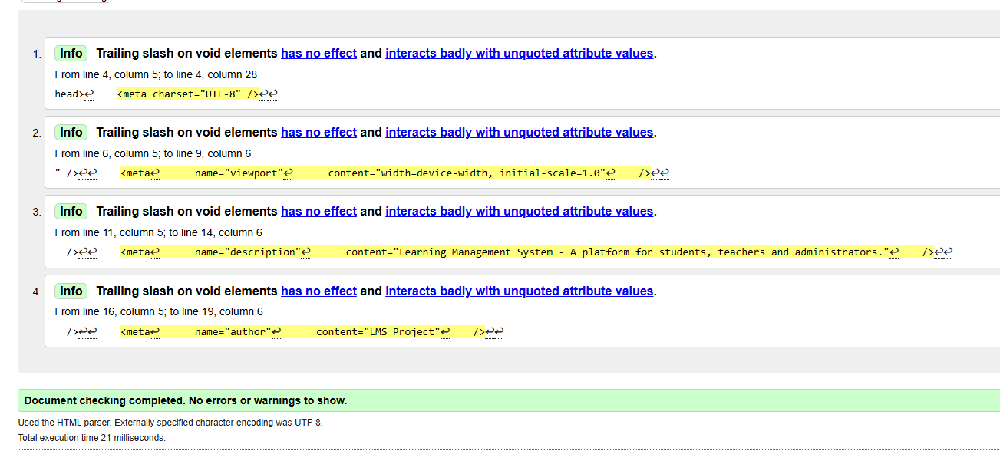
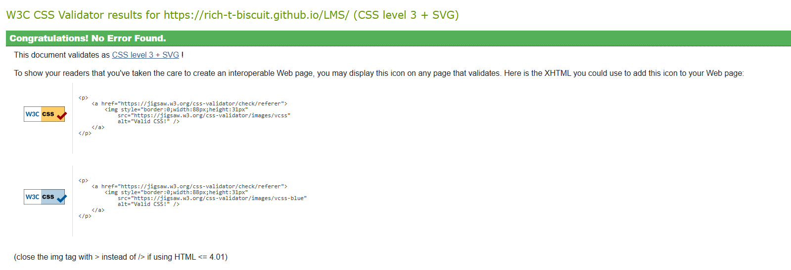
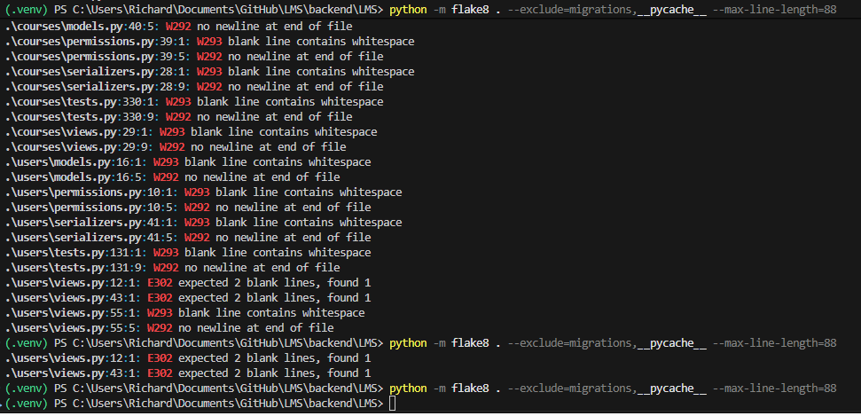
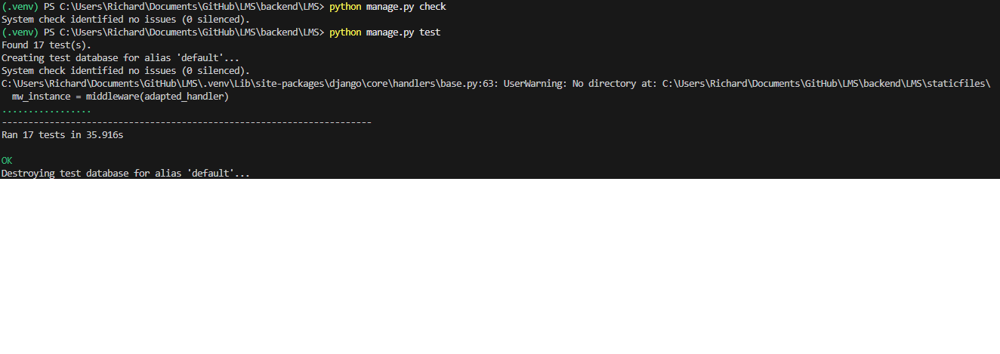
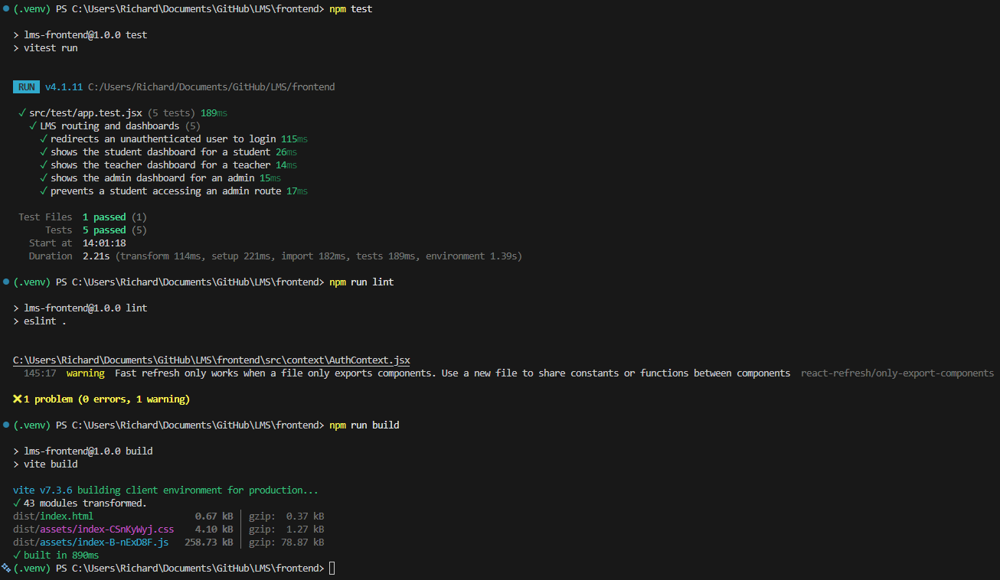

## Screen Size and Responsive Design Testing

### Login - Responsive

### Login - Pixel 10

### Login - iPhone 16 Pro Max

### Student Dashboard - Responsive

### Student Dashboard - Pixel 10

### Student Dashboard - iPhone 16 Pro Max

### Student My Courses - Responsive

### Student My Courses - Pixel 10

### Student My Courses - iPhone 16 Pro Max

### Available Courses - Responsive

### Available Courses - Pixel 10

### Available Courses - iPhone 16 Pro Max

### Teacher Dashboard - Responsive

### Teacher Dashboard - Pixel 10

### Teacher Dashboard - iPhone 16 Pro Max

### Teacher Course Management - Responsive

### Teacher Course Management - Pixel 10

### Teacher Course Management - iPhone 16 Pro Max

### Admin Dashboard - Responsive

### Admin Dashboard - Pixel 10

### Admin Dashboard - iPhone 16 Pro Max

### Admin Manage Users - Responsive

### Admin Manage Users - Pixel 10

### Admin Manage Users - iPhone 16 Pro Max

### Admin Manage Courses - Responsive

### Admin Manage Courses - Pixel 10

### Admin Manage Courses - iPhone 16 Pro Max

## Validation Testing

### W3C HTML Validation
The deployed application was tested using the W3C HTML Validator.

**Result:** Passed — no errors or warnings.

### W3C Jigsaw CSS Validation
The deployed application was tested using the W3C CSS Validation Service.

**Result:** Passed — no errors found.

### Python Validation — Flake8
The Django backend was checked using Flake8. Initial formatting issues were identified and corrected before validation was run again.

**Final result:** Passed — no linting violations found.

### Django System Check and Automated Tests
The Django system check and automated backend test suite were run after the linting amendments.

**Result:** Passed — no system-check issues and 17/17 automated tests passed.

### React Automated Tests, ESLint and Production Build
The React frontend was tested with Vitest and React Testing Library. ESLint and the Vite production build were then run as final frontend safety checks.

**Results:**
- Vitest / React Testing Library: 5/5 tests passed.
- ESLint: 0 errors and 1 non-blocking React Fast Refresh warning.
- Vite production build: passed with 43 modules transformed.

